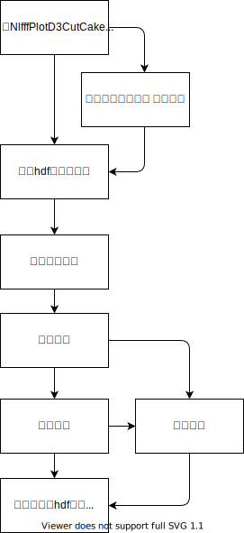

# 三维图像

## 分量切面图NlfffPlotD3CutCake

### 使用流程

创建绘图对象，设置绘图属性（可选），加载数据，添加切面，执行绘制，保存或展示图片，若加载的是hdf数据文件还需要关闭文件。




### 创建绘图对象

```python
from pynlfff.pyplot import plot3d

d3_drawer = plot3d.NlfffPlotD3CutCake()
```

其中可以创建时传入`matplotlib.pyplot.figure`的设置参数，如

```python
from pynlfff.pyplot import plot3d

d3_drawer = plot3d.NlfffPlotD3CutCake(figsize=(6, 6))
```

或者字典形式传入参数

```python
di_config = {
	"figsize": (6, 6)
}
d3_drawer = NlfffPlotD3CutCake(**di_config)
```

### 设置绘图对象属性（可选）

#### 设置调色盘

##### 色调范围

###### 手动设置色调范围

```python
d3_drawer.colormap_set_max=40
# 设置最大显示值

d3_drawer.colormap_set_max=-30
# 设置最小显示值
```


###### 自动设置色调范围

```python
d3_drawer.colormap_auto_value=True
# 自动求的绘图切面中的最大和最小值

d3_drawer.colormap_auto_zip=0.8
# 只有colormap_auto_value为True才生效，表示在自动取最值上再进行压缩，压缩比例，取值范围(0,1]，1表示不压缩

d3_drawer.colormap_auto_mirror=True
# 表示取最值绝对值最大的值为最大值，其相反数为最小值，时得到的调色板关于0对称，注意如果最大值和最小值同为正或同为负，则不生效
```


###### 越界值显示

```python
d3_drawer.colormap_out_range_display=True
# 默认设为True，越界值按照离得最近的那个最值取；为False，越界值不显示
```


##### 透明度

```python
d3_drawer.colormap_alpha=None
# 设置None则不透明

d3_drawer.colormap_alpha="auto"
# 默认，auto自动透明，即绝对值越小透明程度越高

d3_drawer.colormap_alpha=0.8
# 设置整体透明度，取值范围(0,1)
```


#### 设置切面边界和交线

##### 设置切面边界

```python
d3_drawer.cut_line_edges = None
#不绘制边界线

d3_drawer.cut_line_edges = dict(color='0.6', linewidth=0.6, zorder=1e3) 
# 默认，设置边界线样式
```

##### 设置切面交线

```python
d3_drawer.cut_line_cross = None
# 不绘制切面交叉线

d3_drawer.cut_line_cross = dict(color='0.4', linewidth=1, zorder=1e3)
# 默认，设置切面交叉线样式
```


### 加载数据

#### 加载hdf数据

加载数据

```python
data_hdf_path =r"\product1\Bxyz.h5"
load_result = d3_drawer.load_data_hdf(data_hdf_path)
```

在保存或展示完图片后，需要关闭文件

```python
d3_drawer.close_data_hdf()
```


#### 加载四维数组数据

加载四维数组

```python
array_data = np.random.uniform(-5, 5, size=(3, 100,50,40))
d3_drawer.load_data_array(array_data)
```


### 添加绘图切面

```python
d3_drawer.add_cut(B="Bx", N="Nx", cut_num=None, cut_percent=0.5)
```

+ `B`可选值：`Bx`,`By`,`Bz`；表示展示何种分量，选`Bz`则展示`Bz`分量，注意一个对象可以绘制多个切面，每个切面也可以是不同分量
+ `N`可选值：`Nx`,`Ny`,`Nz`；表示切面垂直于哪个坐标轴，注意一个对象可以绘制多个切面，每个切面也可以是取不同`N`，即不同切割方向
+ `cut_num`:可选值`None`或`0-N*`, 即距离坐标原点多远切割； `N*`表示，如果上面`N`取`Nx`，则`N*`必须在`[0,Nx)`范围；如果没有设置则为`None`,根据下面`cut_percent`决定切割位置。
+ `cut_percent`：可选值 `(0,1)`范围内的浮点数，表示距离原点多远的比例进行切割，默认0.5，即中间位置，若`cut_num`设置为不为None，则此项失效。


### 执行绘图操作

使用下面命令开始执行绘图操作，即处理数据，生成图片元素对象，但是如果不展示或者保存下来，仍然无法可视化。

```python
d3_drawer.run_cut()
```


### 保存或展示图片

#### 保存图片

```python
picture_path=r"\product1\NlfffPlotD3CutCake.png"
d3_drawer.savefig(picture_path)
```

其中传入参数需要满足`matplotlib.pyplot.savefig()`方法的参数要求。

```python
if __name__ == "__main__":
    print("start test")
    di = {
        "figsize": (6, 6)
    }
    # d3_drawer = NlfffPlotD3CutCake(**di)
    d3_drawer = NlfffPlotD3CutCake(figsize=(6, 6))
    data_hdf_path =r"/home/zander/Desktop/Bxyz.h5"
    picture_path=r"/home/zander/Desktop/NlfffPlotD3CutCake.png"
    load_result = d3_drawer.load_data_hdf(data_hdf_path)
    if load_result:
        # d3_drawer.colormap_mirror=True
        # d3_drawer.colormap_alpha=0.5
        # d3_drawer.add_cut("Bz", "Nx")
        # d3_drawer.add_cut("Bz", "Ny")
        d3_drawer.add_cut("Bz", "Nz")
        d3_drawer.add_cut("Bz", "Nz", cut_num=0)
        # d3_drawer.add_cut("Bz", "Nx",cut_percent=0.3)
        d3_drawer.add_cut("Bz", "Nz", cut_percent=0.2)
        d3_drawer.run_cut()
        d3_drawer.savefig(picture_path)
        d3_drawer.show()
        d3_drawer.close_data_hdf()
```


#### 展示图片

```python
d3_drawer.show()
```

若需要传入参数，其中传入参数需要满足`matplotlib.pyplot.show()`方法的参数要求。即可以弹出窗口进行交互操作。注意若需要保存图片，需要先保存再调用此方法展示，否则可能展示空白。

### 关闭数据文件

若使用hdf数据源，在保存或展示完图片后，需要关闭文件

```python
d3_drawer.close_data_hdf()
```


